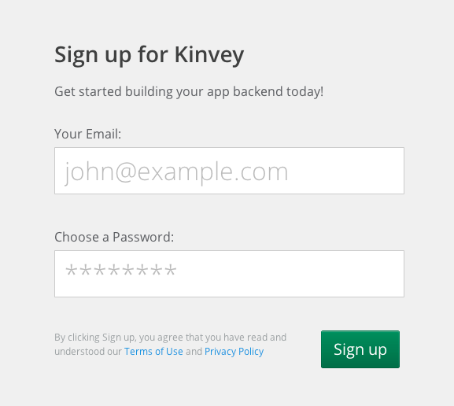
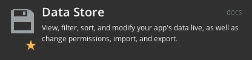
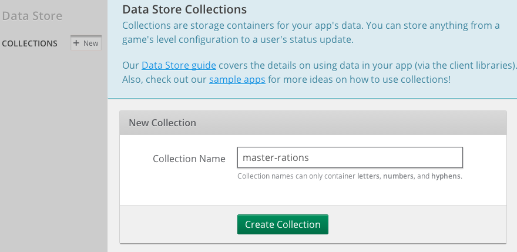
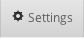
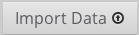

dodhackathon
============

Combat Feeding Ration Data for Department of Defense

## Get a Kinvey account

1. Go to http://console.kinvey.com
* Sign up. It should look something like this: 

Next create a new app backend and skip to the dashboard.

## Import sample data
Create an `master-rations` collection and import json/*.json data to get started. 

1. Click on Addons -> Data & Storage -> Data Store menu item. 
* Create a new collection, call it ‘master-rations’. 
* Click the  button for the applicants collection you just created and the  button, select the json file you want to import.

